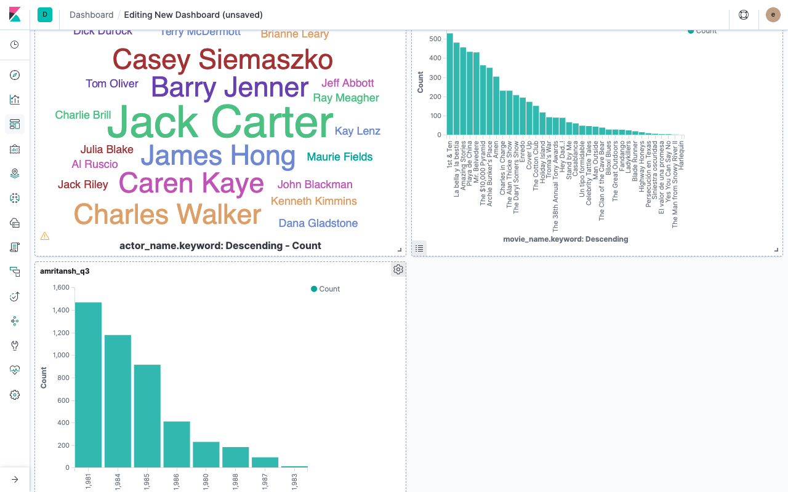
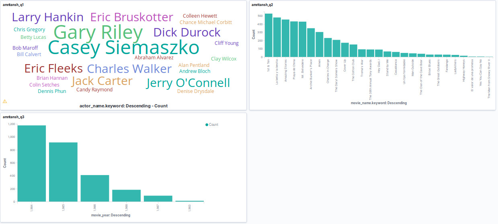
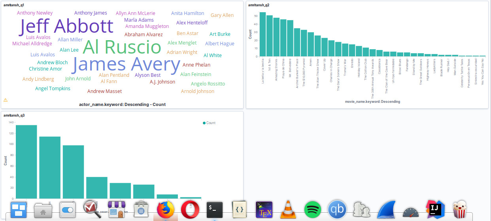

# scrapy-lab

**Q73: Take a screenshot of the Kibana Dashboard showing the above plots without filters. Set a couple of filters, take screetshots. Add all the screenshots to the Lab7 folder of your answers repository.**

**No Filter**

**Filter : Movies released after 1982**

**Filter : Actors with Name/Surname starting with "A"**

**Q75: How long have you been working on this session? What have been the main difficulties you have faced and how have you solved them?**
We've worked on this lab for 12 hours. We faced some difficulty initially in understanding how and where to obtain relevant data/fields from the Page Source of the web-pages and learning the syntax of css/xpath queries. We ran into some problems while configuring ElasticSearch and Kibana, particularly in setting the correct EASTIC_API environment variables.